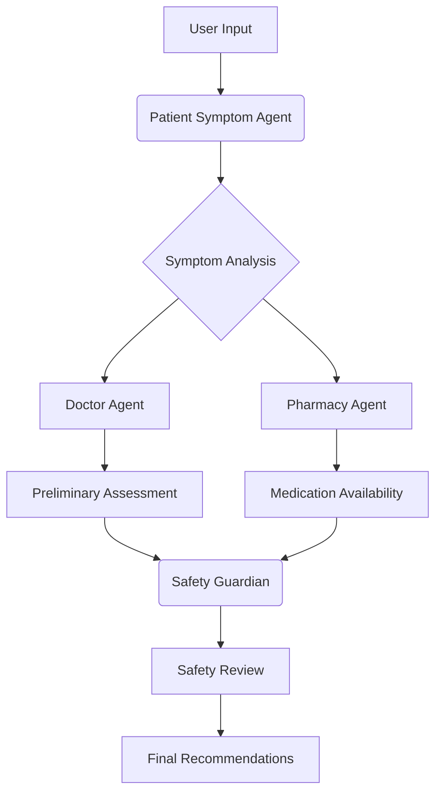

# 🏥 Smart Healthcare Assistant - Multi-Agent System

A comprehensive AI-powered healthcare assistance system that uses multiple specialized agents to provide preliminary medical assessments, medication safety checks, and pharmacy availability information.


## 🌟 Features

### 🤖 Intelligent Agent System
- **Patient Symptom Agent**: Extracts structured medical information from free-text descriptions
- **Doctor Agent**: Creates preliminary assessments and treatment recommendations
- **Pharmacy Agent**: Checks medication availability and suggests alternatives
- **Safety Guardian**: Validates all recommendations against safety rules

### 💊 Comprehensive Medical Information
- Differential diagnosis with likelihood estimates
- Medication recommendations with dosing instructions
- Drug interaction checking
- Allergy contraindication detection
- Pregnancy safety considerations

### 🏪 Indian Pharmacy Integration
- Medication pricing in Indian Rupees (₹)
- Integration with Indian pharmacy chains (Apollo, MedPlus, Netmeds)
- Delivery options and timing information
- Stock availability checking

### 🛡️ Safety First Approach
- Red flag symptom detection
- Age-appropriate recommendations
- Risk level assessment (Low/Medium/High)
- Comprehensive safety reviews

## 📁 Project Structure

```
smart-health-assistant/
├── agents/
│   ├── __init__.py
│   ├── patient_symptom.py      # Symptom extraction agent
│   ├── doctor.py               # Medical assessment agent
│   ├── pharmacy.py             # Pharmacy checking agent
│   └── guardian.py             # Safety validation agent
├── core/
│   ├── __init__.py
│   ├── models.py               # Data models and structures
│   ├── orchestrator.py         # Agent coordination
│   └── rules.py                # Safety rules engine
├── data/
│   └── inventory.csv           # Medication database
├── app/
│   └── streamlit_app.py        # Web interface
├── requirements.txt            # Python dependencies
├── .env                       # Environment variables
└── README.md                  # This file
```

## 🚀 Quick Start

### Prerequisites
- Python 3.8 or higher
- Gemini API key (optional but recommended)

### Installation

1. **Clone the repository**
   ```bash
   git clone https://github.com/yourusername/smart-health-assistant.git
   cd smart-health-assistant
   ```

2. **Create a virtual environment**
   ```bash
   python -m venv .venv
   source .venv/bin/activate  # On Windows: .venv\Scripts\activate
   ```

3. **Install dependencies**
   ```bash
   pip install -r requirements.txt
   ```

4. **Set up environment variables**
   ```bash
   # Create a .env file and add your Gemini API key
   echo "GEMINI_API_KEY=your_actual_api_key_here" > .env
   ```
   
   Get a free API key from [Google AI Studio](https://makersuite.google.com/)

5. **Run the application**
   ```bash
   streamlit run app/streamlit_app.py
   ```

6. **Open your browser**
   Navigate to `http://localhost:8501` to access the application

## 🎯 How to Use

### 1. Patient Information
- Enter your age, sex, and other relevant details
- List any allergies or current medications
- Provide information about medical history

### 2. Symptom Description
Describe your symptoms in detail. Examples:
- "I've had fever of 101°F and sore throat for 2 days"
- "Headache with sensitivity to light for 3 hours"
- "Cough and chest congestion with mild fever"

### 3. Review Results
The system will provide:
- 📋 Preliminary assessment with condition likelihood
- 💊 Medication recommendations with Indian pricing
- 🏪 Pharmacy availability and delivery options
- 🛡️ Safety review and risk assessment
- 📊 Health insights and preventive care advice

## 🔧 Configuration

### Gemini AI Integration
The system uses Google's Gemini AI for enhanced symptom understanding and medical assessment. While the system works without it, Gemini integration significantly improves accuracy.

### Medication Database
Edit `data/inventory.csv` to add or modify medication information:
```csv
name,generic_name,strength,brand,form,manufacturer,in_stock,stock_level,price
paracetamol,paracetamol,500mg,Crocin,tablet,GSK,1,High,15
```

### Safety Rules
Modify `core/rules.py` to customize safety checks and validation rules for your specific requirements.

## 🏗️ System Architecture



## 🧪 Example Usage

### Input:
```
"I'm a 28-year-old male with fever of 101°F, sore throat, and headache for 2 days. Allergic to penicillin."
```

### Output:
- **Assessment**: Viral pharyngitis (65% likelihood), Streptococcal pharyngitis (30%)
- **Medications**: Paracetamol 500mg (₹15), recommended every 6-8 hours
- **Safety Check**: ✅ Approved - No penicillin-containing medications
- **Pharmacy**: Available at Apollo Pharmacy (0.8km away)

## ⚠️ Important Disclaimer

**This is a demonstration system only and not a medical device.**

🚨 **CRITICAL IMPORTANT NOTICE**:
- This system does **NOT** provide medical diagnosis
- It is **NOT** a replacement for professional healthcare
- Always consult with qualified healthcare providers for medical concerns
- In emergencies, call your local emergency services immediately

The system provides **informational guidance only** and should be used as an educational tool rather than a diagnostic system.

## 🛡️ Privacy and Security

- All processing happens locally in your browser
- No personal health information is stored on servers
- You can run the system completely offline without Gemini API
- No data is shared with third parties

## 🌟 Future Enhancements

- [ ] EHR system integration
- [ ] Multi-language support
- [ ] Telemedicine provider APIs
- [ ] Personal health records
- [ ] Adverse reaction monitoring
- [ ] Medical image analysis
- [ ] Voice symptom description
- [ ] Mobile app development

## 🤝 Contributing

We welcome contributions! Please feel free to submit pull requests, open issues, or suggest new features.

### Development Setup
1. Fork the repository
2. Create a feature branch (`git checkout -b feature/amazing-feature`)
3. Commit your changes (`git commit -m 'Add amazing feature'`)
4. Push to the branch (`git push origin feature/amazing-feature`)
5. Open a Pull Request

## 📊 Performance

The system is optimized for:
- **Response Time**: < 5 seconds for most queries
- **Accuracy**: Enhanced with Gemini AI integration
- **Safety**: Multiple validation layers for patient safety
- **Scalability**: Can handle multiple simultaneous users

## 🆘 Emergency Contacts (India)

- **National Emergency Number**: 112
- **Medical Emergency**: 108
- **COVID Helpline**: 1075
- **Mental Health Helpline**: 080-46110007

## 📄 License

This project is licensed under the MIT License - see the [LICENSE](LICENSE) file for details.

## 🙏 Acknowledgments

- Google Gemini AI for enhanced natural language processing
- Indian healthcare providers for medication pricing information
- Open-source healthcare projects that inspired this work
- Medical professionals who provided guidance on safety rules

## 📞 Support

If you have any questions or need help with setup:
1. Check the [Issues](https://github.com/yourusername/smart-health-assistant/issues) page
2. Create a new issue with your question
3. Email: support@healthassist.example.com

---

<div align="center">
  
**Made with ❤️ for better healthcare accessibility**

*Remember: This tool complements but doesn't replace professional medical care*

</div>